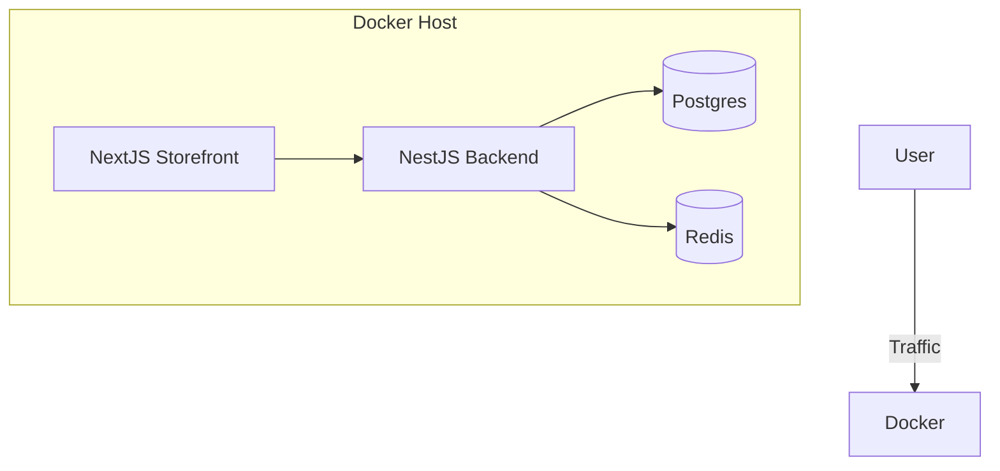

# 📘 Apex Platform - The Comprehensive Protocol
> **"One Protocol to Rule Them All"**
> **Version:** 2.0 (Consolidated)
> **Date:** January 16, 2026
> **Status:** ⚠️ Infrastructure Ready / Application Offline

---

# 📑 Index (الفهرس)
1.  **[Vision & Constitution](#-vision--constitution)** (The Why & The Rules)
2.  **[Server Anatomy & Status](#-server-anatomy--live-status)** (The Where)
3.  **[Ecosystem Architecture](#-ecosystem-architecture)** (The How)
4.  **[Technical Breakdown](#-technical-breakdown)** (The What - Backend/API/DB)
5.  **[Setup & Operations](#-setup--operations-guide)** (The Manual)

---

# 🏛️ Vision & Constitution
> *Imported from APEX_PLATFORM_CONTEXT*

### 🎯 The Strategic Vision
**Apex Platform is NOT just an e-commerce platform.**
It is an **Operating System for the Digital Local Economy** — connecting Merchants, Customers, and Marketers in a smart cooperative network.
*   **Goal:** Enable any entity (Honey seller, Dentist, Academy) to build a digital entity in minutes.
*   **Differentiation:** We don't sell "websites"; we sell **independent digital entities** that grow with their owners.

### 📜 The 3 Golden Rules
1.  **Isolation is NOT a Feature, It's Law.**
    *   Schema-per-Tenant is mandatory. No query shall ever run without a `tenantId`.
2.  **Intelligence is Planted, Not Built.**
    *   All events must be captured with `territory`, `specializationTags`. We don't just store "Sales"; we store "Context".
3.  **Governance is Visibility, Not Interference.**
    *   Super Admin sees all via Audit Logs but never modifies tenant data directly without "Impersonation Mode".

---

# 🗺️ Server Anatomy & Live Status

### 🔴 Live Status: 34.102.65.89
| Service | Port | Status | Details |
|---------|------|--------|---------|
| **PostgreSQL** | `5432` | ✅ **Running** | `apex-postgres` container (Schema-per-Tenant) |
| **Redis** | `6379` | ✅ **Running** | `apex-redis` container (Caching/Queues) |
| **Adminer** | `8080` | ✅ **Running** | `apex-adminer` container (DB GUI) |
| **Backend API** | `3001` | 🔴 **STOPPED** | Node process needs restart |
| **Storefront** | `3002` | 🔴 **STOPPED** | Node process needs restart |

### 🏗️ Infrastructure Map


---

# 🌐 Ecosystem Architecture
> *See detailed [ECOSYSTEM_ARCHITECTURE.md](./ECOSYSTEM_ARCHITECTURE.md) for the full breakdown.*

The platform consists of **5 Connected Projects**:
1.  **📣 Marketing Site:** The Funnel (Signups).
2.  **👑 Super Admin (HQ):** The Governance Layer (Creates Tenants).
3.  **🏢 Tenant Admin:** The Management Layer (Manages Products/Orders).
4.  **🛍️ Storefront:** The Customer Face (Headless Next.js).
5.  **📱 Mobile App:** The Companion (React Native).

**Infinite Governance:**
*   **Audit Middleware:** Intercepts all writes.
*   **Kill Switch:** Super Admin can suspend any tenant instantly.

---

# ⚙️ Technical Breakdown

### 🔙 Backend (NestJS)
*   **Status:** ✅ 90% Complete.
*   **Modules:** 25 Modules Active (Tenants, Vendure, Payments, Analytics, etc.).
*   **Missing:** BillingService, ReportsService, LicensesService.
*   **Test Coverage:** 83% (982/986 Tests Passing).

### 🎨 Frontend (Next.js)
*   **Status:** 🚫 **Experimental / Missing** (See [PAGES_TECHNICAL_AUDIT.md](./PAGES_TECHNICAL_AUDIT.md)).
*   **Critical Gap:** 137+ Pages are missing or need rebuild using `shadcn/ui` boilerplate.
*   **Strategy:** Delete current partial code and adopt `SaaS-Boilerplate` strategy.

### 🗄️ Database (Postgres)
*   **Status:** ✅ 100% Complete.
*   **Schema:** Public (Tenants, Plans) + Tenant Schemas (Vendure tables).
*   **Isolation:** Row Level Security (RLS) enabled.

---

# 🛠️ Setup & Operations Guide
> *Imported from SETUP_GUIDE*

### ⚡ Quick Start
```bash
# 1. Clone
git clone https://github.com/adelfree2023-dev/Apex-Platform-2026.git
cd Apex-Platform-2026

# 2. Backend
cd packages/core
cp .env.example .env
npm install
npx prisma migrate deploy
npm run start:dev

# 3. Frontend
cd packages/storefront
npm install
npm run dev -- -p 3002
```

### 📡 Common Commands
*   **Create Tenant:** `POST /api/tenants`
*   **Migrate Tenant:** `POST /api/tenants/:id/migrate`
*   **Run Tests:** `npm run test` (in packages/core)

---

> **Maintained By:** Apex AI Agent
> **Reference Files:**
> *   [ECOSYSTEM_ARCHITECTURE.md](./ECOSYSTEM_ARCHITECTURE.md)
> *   [PAGES_TECHNICAL_AUDIT.md](./PAGES_TECHNICAL_AUDIT.md)
> *   [PROJECT_EVALUATION.md](./PROJECT_EVALUATION.md)
> *   [EXECUTION_PLAN.md](./EXECUTION_PLAN.md)
