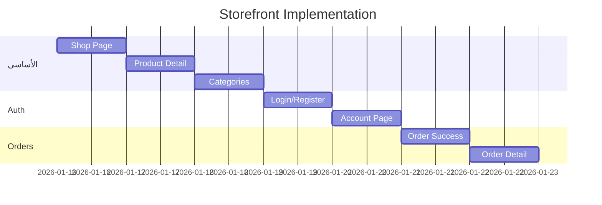
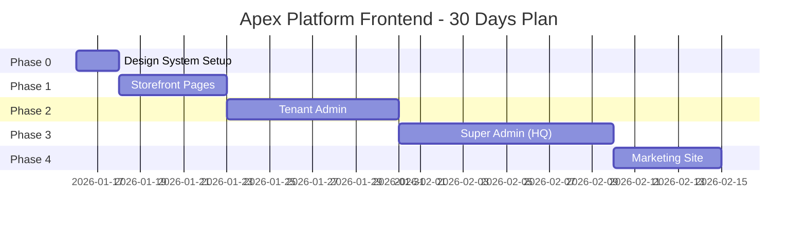

# 🚀 خطة تنفيذ الواجهات - Apex Platform

> **تاريخ الإنشاء:** 2026-01-15  
> **المصدر:** `00_CORE/Pages.md`  
> **المكتبة المختارة:** shadcn/ui + Tailwind CSS

---

## 📊 ملخص الفجوة (Gap Analysis)

### المطلوب vs الموجود

| الواجهة | المطلوب | الموجود | الفجوة | الأولوية |
|---------|---------|---------|--------|----------|
| **Super Admin (HQ)** | 35+ صفحة | 0 | 🔴 100% | P1 |
| **Marketing Site** | 15+ صفحة | 0 | 🔴 100% | P1 |
| **Tenant Admin** | 40+ صفحة | 1 | 🔴 97% | P2 |
| **Storefront** | 25+ صفحة | 6 | 🟡 76% | P2 |
| **Mobile App** | 15+ صفحة | 0 | ⚪ 100% | P3 |

### الموجود حالياً في Storefront:

```
packages/storefront/src/app/
├── [tenantId]/
│   ├── page.tsx          ✅ الصفحة الرئيسية
│   ├── cart/             ✅ السلة
│   ├── checkout/         ✅ الدفع
│   ├── orders/           ✅ الطلبات
│   ├── search/           ✅ البحث
│   ├── flash-sales/      ✅ العروض
│   └── analytics/        ⚠️ (للأدمن)
├── admin/                ⚠️ فارغ
└── globals.css           ⚠️ Tailwind فقط بدون Design System
```

---

## 🎨 المرحلة 0: إعداد Design System (يوم 1-2)

### المهام:

- [ ] **0.1** تثبيت shadcn/ui
  ```bash
  npx shadcn-ui@latest init
  ```

- [ ] **0.2** تكوين الثيم العربي/الإنجليزي
  - RTL Support
  - Arabic Font (Cairo/Tajawal)
  - Color Palette (Egyptian market)

- [ ] **0.3** إنشاء الـ Components الأساسية
  - Button, Input, Card, Table
  - Modal, Dropdown, Tabs
  - Alert, Badge, Avatar

- [ ] **0.4** إنشاء Layout Components
  - Header (Desktop + Mobile)
  - Footer
  - Sidebar (Admin)
  - Breadcrumb

### الملفات:

| الملف | الحالة | الوصف |
|-------|--------|-------|
| `globals.css` | ⚠️ موجود | يحتاج إعادة بناء |
| `components/ui/` | ❌ غير موجود | إنشاء من shadcn |
| `lib/utils.ts` | ❌ غير موجود | cn() helper |

---

## 🛍️ المرحلة 1: Storefront الأساسي (يوم 3-7)

> **الأولوية:** P2 — ضروري للإطلاق

### 1.1 الصفحات المطلوبة

| الصفحة | المسار | الحالة | Backend API |
|--------|--------|--------|-------------|
| الرئيسية | `/` | ✅ موجود | ✅ VendureService |
| قائمة المنتجات | `/shop` | ❌ ناقص | ✅ getProducts |
| تفاصيل المنتج | `/product/[slug]` | ❌ ناقص | ✅ getProducts |
| التصنيفات | `/shop/[category]` | ❌ ناقص | ✅ getCategories |
| السلة | `/cart` | ✅ موجود | ✅ Cart APIs |
| الدفع | `/checkout` | ✅ موجود | ✅ checkout |
| تأكيد الطلب | `/checkout/success` | ❌ ناقص | ✅ getOrderById |
| الطلبات | `/orders` | ✅ موجود | ✅ getOrders |
| تفاصيل الطلب | `/orders/[id]` | ❌ ناقص | ✅ getOrderById |
| البحث | `/search` | ✅ موجود | ✅ searchProducts |
| تسجيل الدخول | `/login` | ❌ ناقص | ✅ Auth Module |
| إنشاء حساب | `/register` | ❌ ناقص | ✅ Auth Module |
| الحساب | `/account` | ❌ ناقص | ⚠️ يحتاج تطوير |
| المفضلة | `/wishlist` | ❌ ناقص | ✅ WishlistService |

### 1.2 خطة التنفيذ



---

## 🏢 المرحلة 2: Tenant Admin Dashboard (يوم 8-15)

> **الأولوية:** P2 — ضروري لإدارة المتجر

### 2.1 الصفحات الأساسية

| الصفحة | المسار | Backend API |
|--------|--------|-------------|
| Dashboard | `/dashboard` | AnalyticsService |
| قائمة المنتجات | `/products` | VendureService |
| إضافة منتج | `/products/new` | createProduct |
| تعديل منتج | `/products/[id]` | updateProduct |
| الطلبات | `/orders` | getOrders |
| تفاصيل الطلب | `/orders/[id]` | getOrderById |
| العملاء | `/customers` | getCustomers |
| التحليلات | `/analytics` | AnalyticsService |
| الإعدادات | `/settings` | TenantSettings |
| الدفع | `/payments` | PaymentsService |
| الشحن | `/shipping` | ShippingService |
| العروض | `/marketing/discounts` | PromotionsService |

### 2.2 الملفات المطلوبة

```
packages/storefront/src/app/[tenantId]/admin/
├── layout.tsx              → Sidebar + Header
├── page.tsx                → Dashboard
├── products/
│   ├── page.tsx            → Product List
│   ├── new/page.tsx        → Add Product
│   └── [id]/page.tsx       → Edit Product
├── orders/
│   ├── page.tsx            → Orders List
│   └── [id]/page.tsx       → Order Detail
├── customers/
│   └── page.tsx            → Customers List
├── analytics/
│   └── page.tsx            → Analytics Dashboard
├── settings/
│   ├── page.tsx            → General Settings
│   ├── payments/page.tsx   → Payment Methods
│   └── shipping/page.tsx   → Shipping Zones
└── marketing/
    └── discounts/page.tsx  → Coupons
```

---

## 🔐 المرحلة 3: Super Admin (HQ) (يوم 16-25)

> **الأولوية:** P1 — ضروري للتشغيل

### 3.1 الصفحات الأساسية

| الصفحة | المسار | Backend API |
|--------|--------|-------------|
| Dashboard | `/admin/dashboard` | TenantsService |
| قائمة المستأجرين | `/admin/tenants` | TenantsService |
| تفاصيل المستأجر | `/admin/tenants/[id]` | TenantsService |
| إنشاء مستأجر | `/admin/tenants/new` | createTenant |
| الرخص | `/admin/licenses` | LicenseService |
| الخطط | `/admin/plans` | PlansService |
| الفوترة | `/admin/billing` | BillingService |
| التحليلات | `/admin/analytics` | AnalyticsService |
| المستخدمين | `/admin/users` | UsersService |
| الإعدادات | `/admin/settings` | SettingsService |

### 3.2 الـ APIs الناقصة

> ⚠️ **تحتاج تطوير في Backend:**

| الـ API | الحالة | الأولوية |
|---------|--------|----------|
| LicenseService | ❌ ناقص | P1 |
| PlansService | ❌ ناقص | P1 |
| BillingService | ⚠️ جزئي | P1 |
| SuperAdmin Auth | ❌ ناقص | P1 |

---

## 🌐 المرحلة 4: Marketing Site (يوم 26-30)

> **الأولوية:** P1 — ضروري للتسويق

### 4.1 الصفحات

| الصفحة | المسار |
|--------|--------|
| الرئيسية | `/` |
| التسعير | `/pricing` |
| الميزات | `/features` |
| تواصل معنا | `/contact` |
| من نحن | `/about` |
| المدونة | `/blog` |
| تسجيل الدخول | `/login` |
| إنشاء حساب | `/register` |
| الشروط | `/terms` |
| الخصوصية | `/privacy` |

### 4.2 ملاحظة

Marketing Site يجب أن يكون **مشروع منفصل** أو على subdomain مختلف:
- `www.apex-platform.com` → Marketing
- `app.apex-platform.com` → Admin
- `[tenant].apex-platform.com` → Storefront

---

## 📅 الجدول الزمني الإجمالي



---

## ✅ الخطوة التالية الفورية

### اليوم (يوم 1):

1. **تثبيت shadcn/ui:**
   ```bash
   cd packages/storefront
   npx shadcn-ui@latest init
   ```

2. **إضافة Components الأساسية:**
   ```bash
   npx shadcn-ui@latest add button input card
   npx shadcn-ui@latest add table dropdown-menu tabs
   ```

3. **إنشاء `/shop` page**

---

## 📋 ملخص القرارات

| القرار | الخيار |
|-------|--------|
| UI Library | shadcn/ui |
| CSS Framework | Tailwind CSS |
| Font (Arabic) | Cairo / Tajawal |
| State Management | React Context / Zustand |
| Form Handling | react-hook-form + zod |
| API Client | fetch / axios |
| RTL Support | نعم |
| Dark Mode | نعم |

---

**هل توافق على هذه الخطة؟ 🚀**
